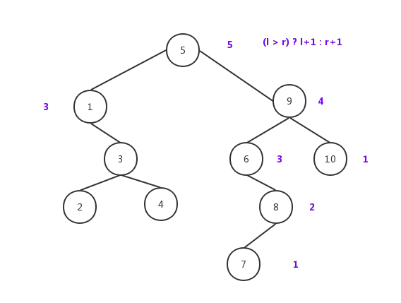

# 二叉树

[TOC]

## 概念
>二叉树（英语：Binary tree）是每个节点最多只有两个分支(不存在分支度大于2的节点)的树结构。通常分支被称作“左子树”和“右子树”。二叉树的分支具有左右次序，不能颠倒。
                                    -- wikipedia

1. 根节点： 没有父节点的节点，一棵二叉树树只有一个根节点。
2. 叶子节点: 没有子节点的节点，也叫终端结点。
3. 层：指树的层次结构
4. 满二叉树：每一个层次的节点数都达到最大值
5. 完全二叉树:深度为k有n个节点的二叉树，当且仅当其中的每一节点，都可以和同样深度k的满二叉树，序号为1到n的节点一对一对应时，称为“完全二叉树”

## 属性

* 第i层最多有2^(i-1)节点，深度为k的二叉树至多总共有2^(k+1)-1个节点数。
* 左子树值小于节点值，节点值小于右子树节点值。

## 数据结构
```java
public class BinaryNode<T extends Comparable> {
    public T data;// 节点值
    public BinaryNode<T> left;//左子树
    public BinaryNode<T> right;//右子树

    /**
     * data和左右子树构造节点
     *
     * @param data  节点值
     * @param left  左子树
     * @param right 右子树
     */
    public BinaryNode(T data, BinaryNode<T> left, BinaryNode<T> right) {
        this.data = data;
        this.left = left;
        this.right = right;
    }

    /**
     * data构造节点
     *
     * @param data 节点值
     */
    public BinaryNode(T data) {
        this(data, null, null);
    }
}
```
## 操作
定义BinarySearchTree实现二叉查找一些方法。

### 插入
插入思路比较简单，和节点比较，如果小于插入左边节点，如果大于插入右边，因为是从根节点开始，采用递归方式。

```java
public void insert(T data) {
    if (data == null) {
        throw new RuntimeException("data is null");
    }
    root = insert(data, root);
}
private BinaryNode<T> insert(T data, BinaryNode<T> node) {
    if (node == null) {     //节点为空，则赋值
        node = new BinaryNode<T>(data);
    }
    int result = data.compareTo(node.data);
    if (result < 0) {       // 左
        node.left = insert(data, node.left);
    } else if (result > 0) {// 右
        node.right = insert(data, node.right);
    }
    return node;
}
```
递归思路很简单，按逻辑写下去，找到进入点、停止条件、返回值。

### 删除
1. 没有子节点：直接删除
2. 有一子个节点：删除后子节点替代被删除节点位置
3. 有两个子节点：找到右子树中最小节点，替换被删除节点(子树的最小节点替换时，也按照同样逻辑)

```java
```

### 找子树中最小节点(值)
递归左子树，左节点为空时，对应节点为最小节点,同样，最大子节点也类似。

```java
public T findMin() {
    if (root == null) {
        throw new RuntimeException("root is null");
    }
    return findMin(root).data;
}

/**
 * 根据输入节点作为根节点查找树中最小节点
 *
 * @param node
 * @return 最小节点
 */
private BinaryNode<T> findMin(BinaryNode<T> node) {
    if (node == null) {
        throw new RuntimeException("Node is null");
    }
    if (node.left == null) {// (1). 左节点空，则最小
        return node;
    }
    return findMin(node.left);//(2). 不空，则递归
}
```
### 深度
深度，即二叉树有几个层级。



递归遍历，最子树比较后，大的值加1。如7，没有子节点，则为1，节点8左子树遍历返回值1，右子树返回0，结果是1+1=2.

```java
private int height(BinaryNode<T> node) {
    if (node == null) {
        return 0;
    }else {
        int l = height(node.left);
        int r = height(node.right);
        return (l > r) ? l+1 : r+1;
    }
}
```
### 节点数size
节点数计算和深度类似，只是把左右节点累加，递归算法如下：

```java
private int size(BinaryNode<T> node) {
    if (node == null) {
        return 0;
    } else {
        return size(node.left) + 1 + size(node.right);
    }

}

```

### 第K层的节点数


如图，求3层节点数，从根节点遍历。子树为空返回0，否则一直k-1，直到k=1时返回1.再把左右遍历返回值相加。

```java
 private int kSize(BinaryNode<T> node,int k) {
    if (node == null) {
        return 0;
    }
    if (k == 1) {
        return 1;
    }
    return kSize(node.left, k - 1) + kSize(node.right, k - 1);
}

```

### 判断两棵二叉树是否结构相同
递归比对节点，如果有一个节点为空，另一数的节点不为空，结构就不同。

### 求二叉树镜像
交换每个节点的左右子树即可，镜像后，中序遍历为逆序。

### 求两个结点的最低公共祖先结点
从根节点遍历，如果两个几点都比节点小，在左子树，反之在右子树。如果在中间，即是此节点。


### 遍历
#### 前序遍历
先访问根节点，再访问左子树，最后访问右子树。
#### 中序遍历
先访问左子树，再访问根节点，最后访问右子树。
#### 后序遍历
先访问左子树，再访问右子树，最后访问根节点。
#### 层次遍历
按照层级从左到右遍历。
这种遍历方式相对复杂，因为左右没有关联关系，只能一个个节点访问，按顺序把节点存起来，再从队列中取出节点访问其子树。可以通过一个FIFO队列实现。

## 


